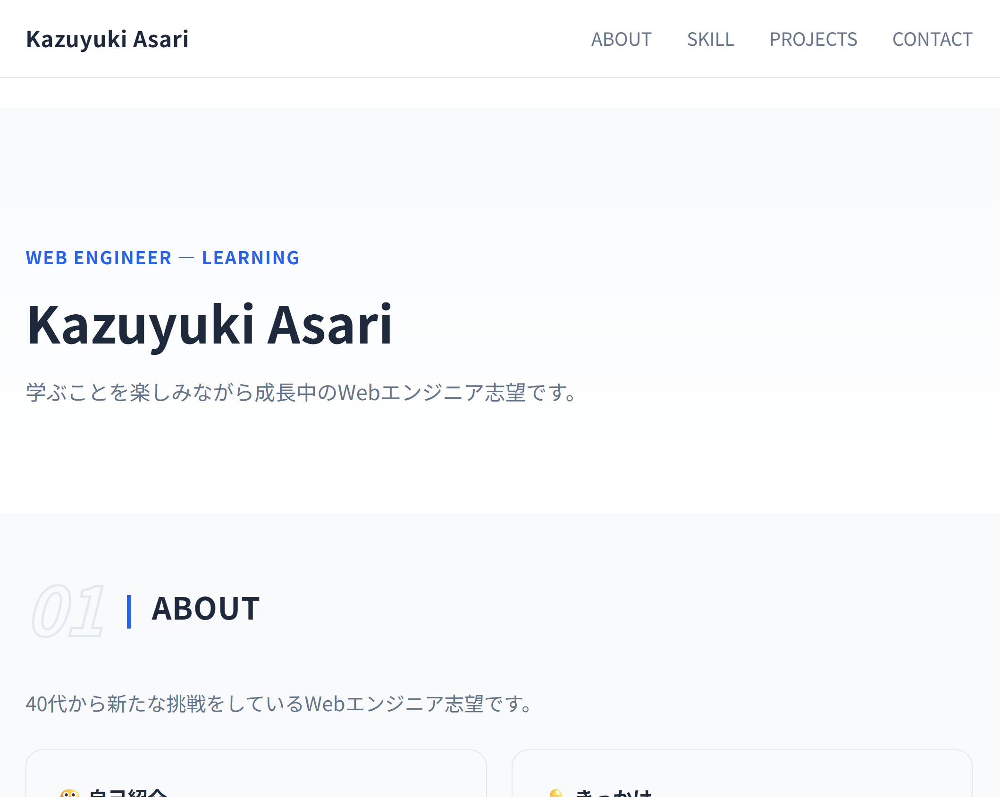
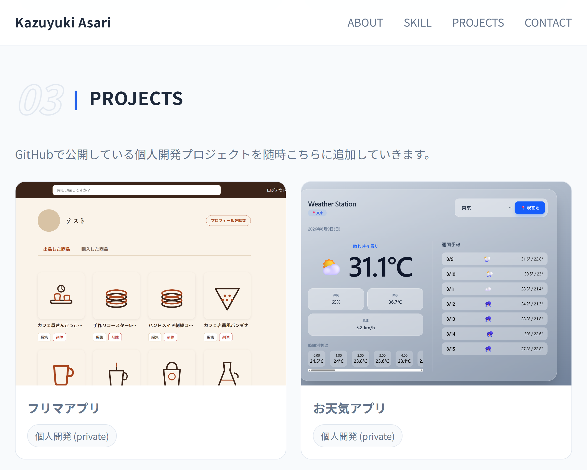
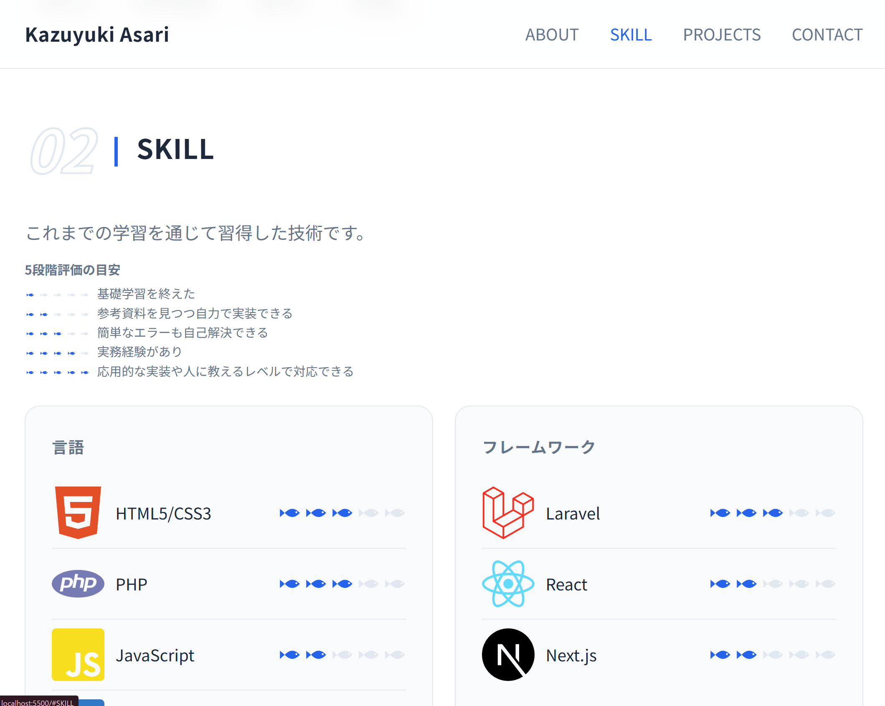
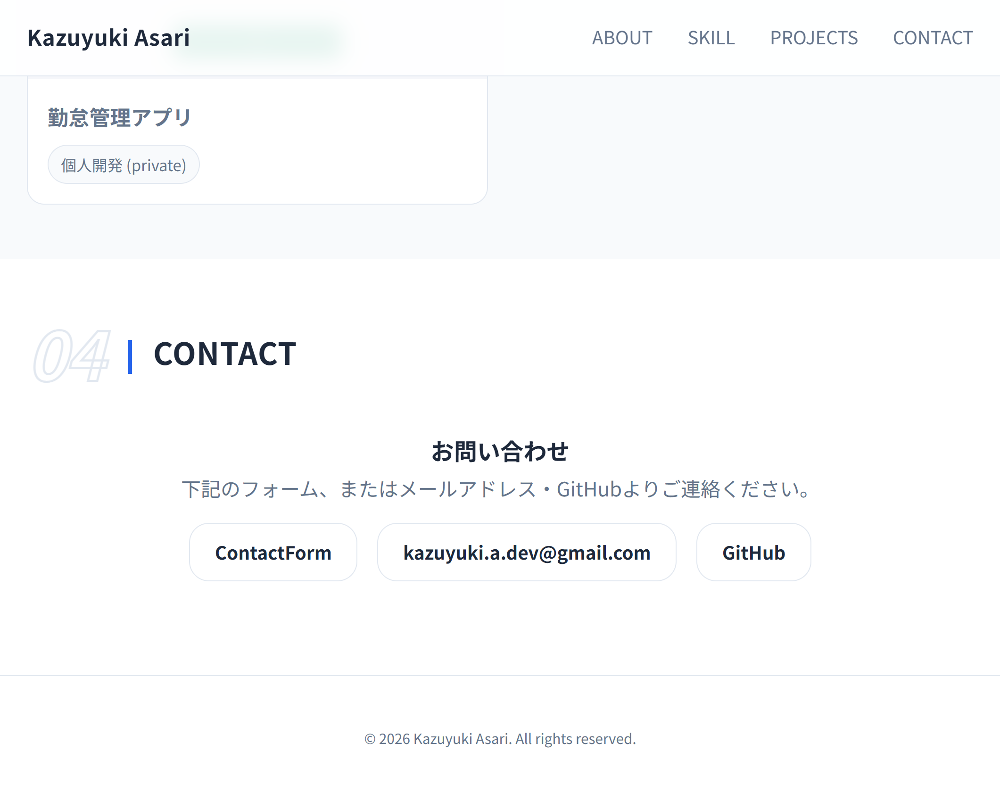

# Kazuyuki Asari Portfolio

Webエンジニアとしてのポートフォリオサイトです。
自己紹介、スキル、制作物（PROJECTS）、お問い合わせフォームをまとめています。

**URL：** https://（Netlifyデプロイ後のURLをここに記載）

---

## 使用技術


- HTML5 / CSS3（フレームワーク不使用・素のCSS）
- JavaScript（Vanilla JS、ライブラリ不使用）
- Netlify（ホスティング／お問い合わせフォームは Netlify Forms を使用）

---

## スクリーンショット

|                    TOPページ                    |                  PROJECTSセクション                  |
| :---------------------------------------------: | :--------------------------------------------------: |
|  |  |

|                  SKILLセクション                  |                    CONTACTページ                    |
| :-----------------------------------------------: | :-------------------------------------------------: |
|  |  |

---

## ページ構成／機能一覧

- **HEADER**
  - ロゴクリックでTOPへ戻る
  - ハンバーガーメニュー（レスポンシブ対応時）
- **ABOUT**
  - 自己紹介、経歴、学習中の技術一覧
- **SKILL**
  - 5段階評価（オリジナルアイコンによる評価表示）でスキルを紹介
- **PROJECTS**
  - これまでに制作したアプリを一覧表示（詳細ページへリンク）
  - 画像スライダー（矢印・ドット操作、前後の画像がうっすら見えるピーク表示）による作品紹介
- **CONTACT**
  - お問い合わせフォーム（Netlify Forms／ハニーポットによるスパム対策）
  - 送信完了ページへのリダイレクト

---

## 掲載プロジェクト

| プロジェクト名             | 概要                                                                           | リポジトリ                                                                                                                                                    |
| -------------------------- | ------------------------------------------------------------------------------ | ------------------------------------------------------------------------------------------------------------------------------------------------------------- |
| Latte&Item（フリマアプリ） | Laravel製のフリマアプリ。Stripe決済実装、PHPUnitによるテスト59件               | [fleamarket-sample](https://github.com/kazuyuki-a-dev/fleamarket-sample)                                                                                      |
| 天気予報アプリ             | 位置情報・郵便番号から天気を取得できるフロントエンド／バックエンド構成のアプリ | [weather-app-frontend](https://github.com/kazuyuki-a-dev/weather-app-frontend) / [weather-app-backend](https://github.com/kazuyuki-a-dev/weather-app-backend) |
| 勤怠管理アプリ             | Laravel製の勤怠管理システム。PHPUnitによるテスト34件                           | [attendance-management](https://github.com/kazuyuki-a-dev/attendance-management)                                                                              |

各プロジェクトの詳細（開発期間・使用技術・機能一覧など）はポートフォリオサイト内の各詳細ページ、またはリンク先の各リポジトリのREADMEをご覧ください。

---

## 環境構築

このサイトはビルドツールを使用していない静的サイトのため、特別なセットアップは不要です。

```bash
# リポジトリをクローン
git clone git@github.com:kazuyuki-a-dev/my-portfolio.git

# ディレクトリへ移動
cd my-portfolio

# index.html をブラウザで直接開く、または
# VSCodeの Live Server 拡張機能などでローカルサーバーを起動して確認
```

---

## ディレクトリ構成（抜粋）

```
my-portfolio/
├── index.html
├── contact.html
├── thanks.html
├── css/
│   └── style.css
├── js/
│   └── script.js
├── images/
│   └── screenshots/
└── projects/
    ├── fleamarket-sample.html
    ├── weather-app.html
    └── attendance-management.html
```

---

## 実行環境

| 項目         | 内容          |
| ------------ | ------------- |
| ホスティング | Netlify       |
| フォーム機能 | Netlify Forms |

---

## 作成者

Kazuyuki Asari

- GitHub: [@kazuyuki-a-dev](https://github.com/kazuyuki-a-dev)
